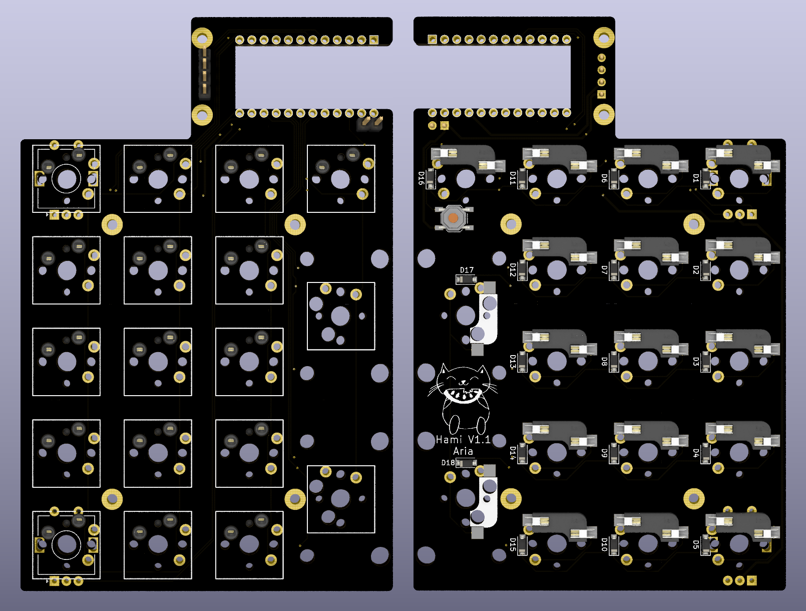

# Hami
 Simple numberpad with OLED and encoder support, nothing else to say really. Designed for use with a standard 0.91" SSD1306 OLED or the [Crenshaw](https://github.com/Ariamelon/Crenshaw) 1.3" OLED breakout board.

 

 ## Changelog
 * 27/09/2020: Initial commit.
 * 28/09/2020: Added rotary encoder support.
 * 24/10/2020: Updated to V1.1. Moved position of OLED to allow for enough room and changed design of plate to compensate.
