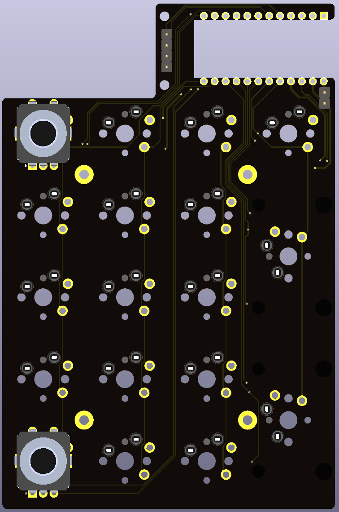
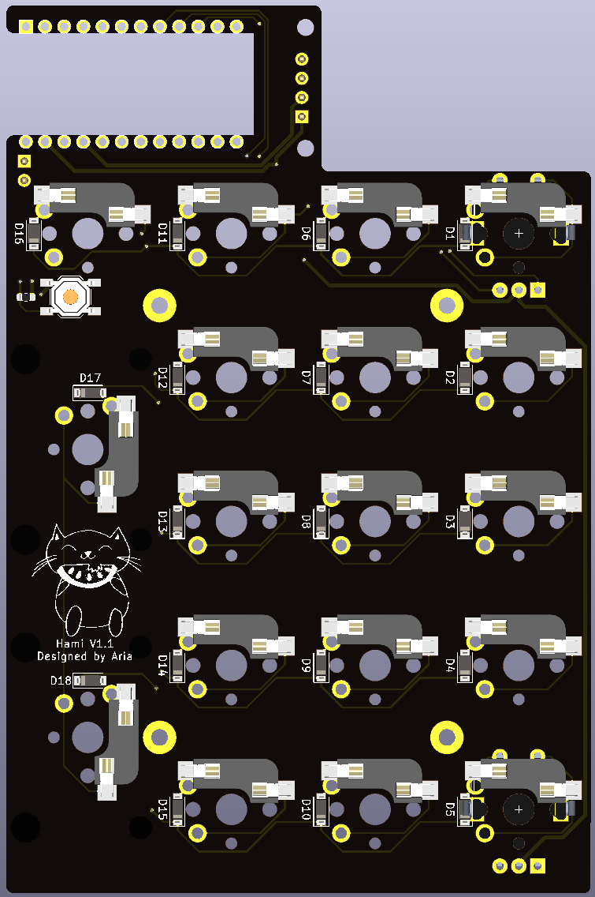

# Hami
 Simple numberpad with OLED and encoder support, nothing else to say really. Designed for use with a standard 0.91" SSD1306 OLED or the [Crenshaw](https://github.com/Ariamelon/Crenshaw) 1.3" OLED breakout board.

  
